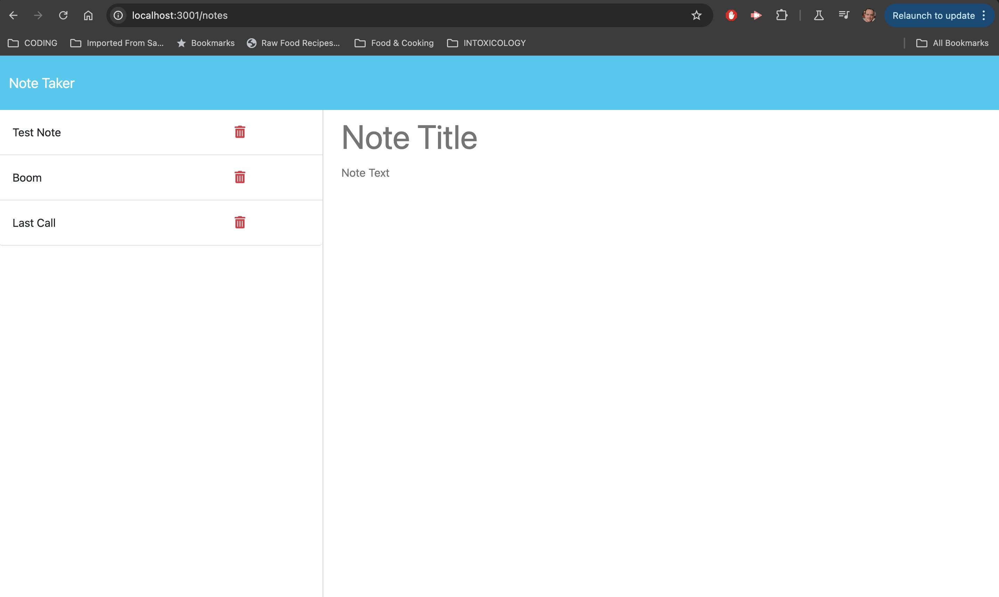

# Express Note Taker 

# 

## Description 
An application that provides the user the ability to add new notes, and to delete notes. 

## Table of Contents
* [Installation](#installation)
* [Usage](#usage)
* [Links](#links)
* [Screenshots](#screenshots)

## Installation 

Clone the repository from GitHub. The user then needs to install Express.js.
 

## Usage
To create new notes in the right-hand column.

## Links

To View the Application: <a href="https://express-js-note-taker-bvat.onrender.com/notes"> Click Here</a>

## Screenshots
 
